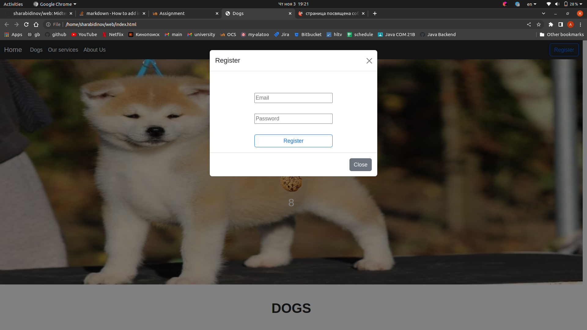
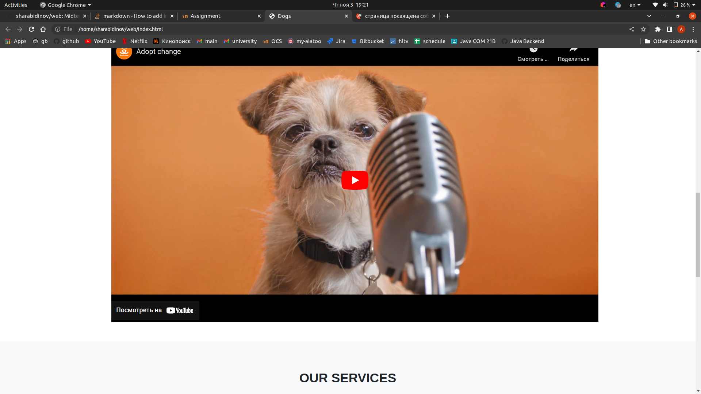

# web
[Midterm project page](https://sharabidinov.github.io/web/)

### Performance test

## About project
* Web page is about dogs :)
* Responsive
* With clicker, FetchAPI, registration form, navbar and etc

